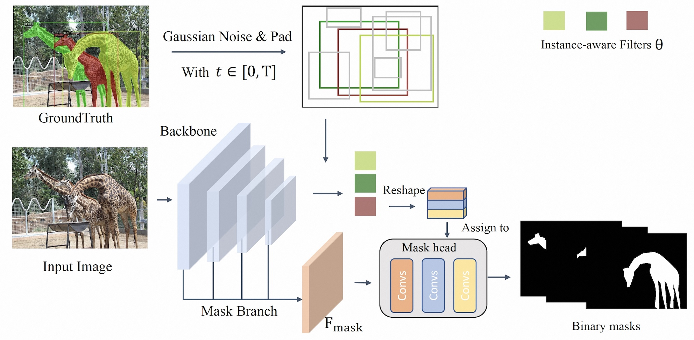

## DiffusionInst: Diffusion Model for Instance Segmentation

**DiffusionInst is the first work of diffusion model for instance segmentation.**

## Getting Started
The installation instruction and usage are in [Getting Started with DiffusionInst](GETTING_STARTED.md).

## Model Performance
Method | Mask AP (1 step) | Mask AP (4 step) 
--- |:---:|:---:
COCO-Res50 | 35.1| 35.5 
COCO-Res101 | 36.3| 36.5 
COCO-Swin-B| 44.0| 44.2
LVIS-Res50 | 22.3| - 
LVIS-Res101| 24.6| - 
LVIS-Swin-B| 34.8| - 

